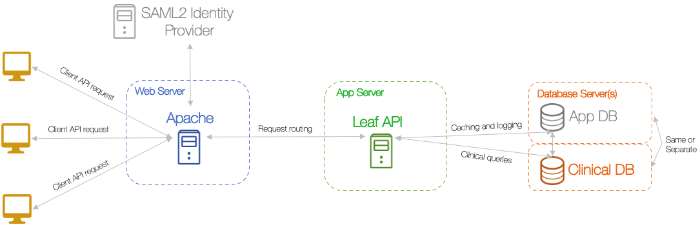

# Architecture
Leaf is designed to be deployed in a standard <a href="https://en.wikipedia.org/wiki/Multitier_architecture" target="_blank">three-tier architecture</a>. These tiers are:

 

1. **Database Server**, with
    - The clinical database you'd like to point Leaf at deployed in <a href="https://www.microsoft.com/en-us/sql-server/default.aspx" target="_blank">MS SQL Server</a> (2014+).
    - <a href="https://github.com/uwrit/leaf/blob/master/src/db/build/LeafDB.sql" target="_blank">Leaf application database</a>. Note that this *must* be the same server the clinical database ↑ is deployed to.

2. **Application Server**, with
    - <a href="https://dotnet.microsoft.com/download" target="_blank">.NET Core Runtime</a> installed.
    - Note that this *can* be the same server as the web server, though ideally they should be separate depending on hardware, relative load, and number of users.

3. **Web Server**, with
    - <a href="https://en.wikipedia.org/wiki/Apache_HTTP_Server" target="_blank">Apache</a> or <a href="https://www.iis.net/overview" target="_blank">IIS</a> installed to handle <a href="https://en.wikipedia.org/wiki/HTTPS" target="_blank">https</a> routing for requests from the <a href="https://github.com/uwrit/leaf/tree/master/src/ui-client" target="_blank">client app</a>. These can be configured to work with a <a href="https://en.wikipedia.org/wiki/SAML_2.0" target="_blank">SAML2</a> Identity Provider to manage user authentication and authorization, such as <a href="https://www.shibboleth.net/index/" target="_blank">Shibboleth</a> or <a href="https://docs.microsoft.com/en-us/windows-server/identity/active-directory-federation-services" target="_blank">ADFS</a>.

 
Next: [Step 1 - Configuring the App server](./installation_steps/1_app_server)